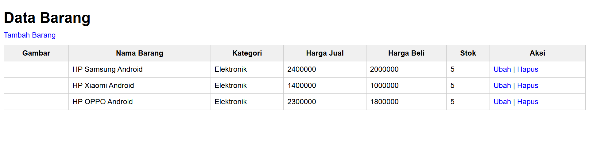

# Praktikum 8: PHP dan Database MySQL

## Nama: Syafarudiansya
## NIM: 312410381
## Kelas: TI 24 A6

### 1. Membuat Database


### 2. Membuat Tabel


### 3. Menambahkan Data


### Hasil:


### Membuat Program CRUD

#### 1. Membuat file koneksi.php
```php
<?php
$host = "localhost";
$user = "root";
$pass = "";
$db = "latihan1";

$conn = mysqli_connect($host, $user, $pass, $db);
if ($conn == false)
{
    echo "Koneksi ke server gagal.";
    die();
} #else echo "Koneksi berhasil";
?>
```
Buka melalui browser untuk menguji koneksi database (untuk menyampilkan pesan
koneksi berhasil, uncomment pada perintah echo “koneksi berhasil”;


#### 2. Membuat file index untuk menampilkan data (Read)
```php html
include("koneksi.php");
// query untuk menampilkan data
$sql = 'SELECT * FROM data_barang';
$result = mysqli_query($conn, $sql);
?>
<!DOCTYPE html>
<html lang="en">
<head>
    <meta charset="UTF-8">
    <link href="style.css" rel="stylesheet" type="text/css" />
    <title>Data Barang</title>
</head>
<body>
    <h1>Data Barang</h1>
    <a href="tambah.php">Tambah Barang</a>
    <table>
        <tr>
            <th>Gambar</th>
            <th>Nama Barang</th>
            <th>Kategori</th>
            <th>Harga Jual</th>
            <th>Harga Beli</th>
            <th>Stok</th>
            <th>Aksi</th>
        </tr>
        <?php if ($result && mysqli_num_rows($result) > 0): ?>
            <?php while ($row = mysqli_fetch_assoc($result)): ?>
                <tr>
                    <td>" alt=""></td>
                    <td><?= $row['nama']; ?></td>
                    <td><?= $row['kategori']; ?></td>
                    <td><?= $row['harga_jual']; ?></td>
                    <td><?= $row['harga_beli']; ?></td>
                    <td><?= $row['stok']; ?></td>
                    <td>
                        <a href="ubah.php?id=<?= $row['id_barang']; ?>">Ubah</a> |
                        <a href="hapus.php?id=<?= $row['id_barang']; ?>">Hapus</a>
                    </td>
                </tr>
            <?php endwhile; ?>
        <?php else: ?>
            <tr>
                <td colspan="7">Belum ada data</td>
            </tr>
        <?php endif; ?>
    </table>
</body>
</html>
```

