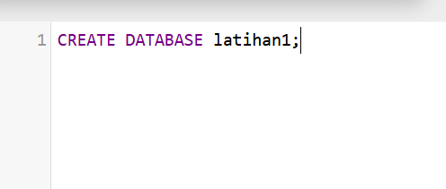
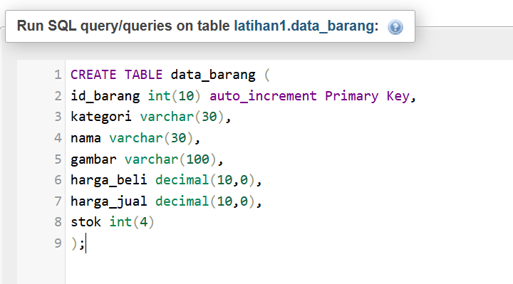
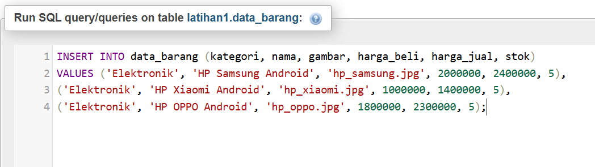
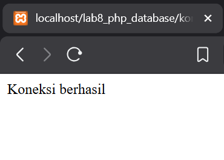

# Praktikum 8: PHP dan Database MySQL

## Nama: Syafarudiansya
## NIM: 312410381
## Kelas: TI 24 A6

### 1. Membuat Database


### 2. Membuat Tabel


### 3. Menambahkan Data


### Hasil:


### Membuat Program CRUD

#### 1. Membuat file koneksi.php
```php
<?php
$host = "localhost";
$user = "root";
$pass = "";
$db = "latihan1";

$conn = mysqli_connect($host, $user, $pass, $db);
if ($conn == false)
{
    echo "Koneksi ke server gagal.";
    die();
} #else echo "Koneksi berhasil";
?>
```
Buka melalui browser untuk menguji koneksi database (untuk menyampilkan pesan
koneksi berhasil, uncomment pada perintah echo “koneksi berhasil”;


