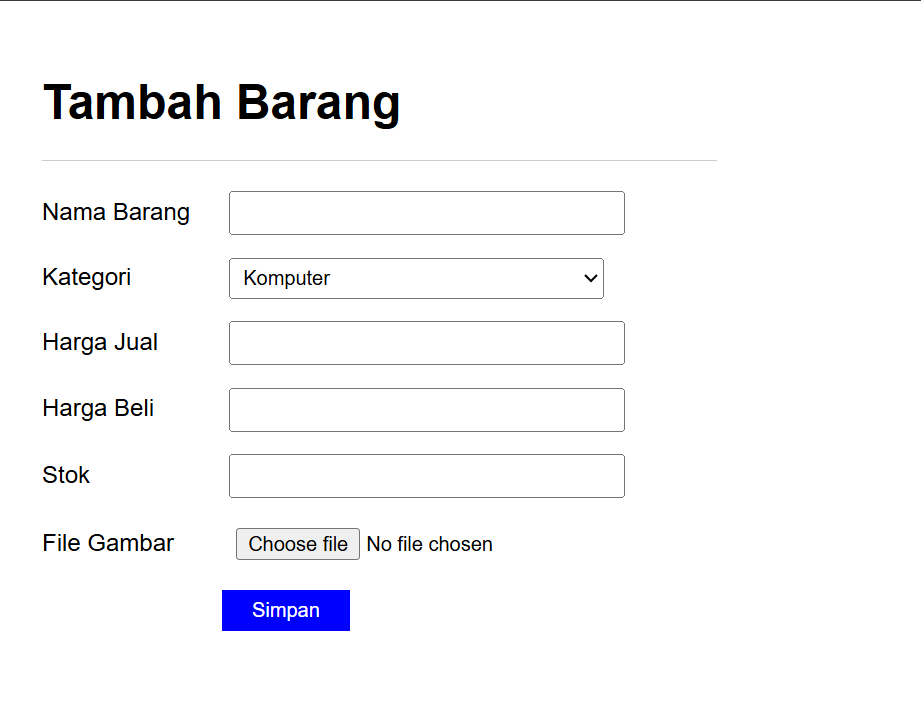

# Praktikum 8: PHP dan Database MySQL

## Nama: Syafarudiansya
## NIM: 312410381
## Kelas: TI 24 A6

### 1. Membuat Database


### 2. Membuat Tabel


### 3. Menambahkan Data


### Hasil:


### Membuat Program CRUD

#### 1. Membuat file koneksi.php
```php
<?php
$host = "localhost";
$user = "root";
$pass = "";
$db = "latihan1";

$conn = mysqli_connect($host, $user, $pass, $db);
if ($conn == false)
{
    echo "Koneksi ke server gagal.";
    die();
} #else echo "Koneksi berhasil";
?>
```
Buka melalui browser untuk menguji koneksi database (untuk menyampilkan pesan
koneksi berhasil, uncomment pada perintah echo “koneksi berhasil”;


#### 2. Membuat file index untuk menampilkan data (Read)
```php, html
include("koneksi.php");
// query untuk menampilkan data
$sql = 'SELECT * FROM data_barang';
$result = mysqli_query($conn, $sql);
?>
<!DOCTYPE html>
<html lang="en">
<head>
    <meta charset="UTF-8">
    <link href="style.css" rel="stylesheet" type="text/css" />
    <title>Data Barang</title>
</head>
<body>
    <h1>Data Barang</h1>
    <a href="tambah.php">Tambah Barang</a>
    <table>
        <tr>
            <th>Gambar</th>
            <th>Nama Barang</th>
            <th>Kategori</th>
            <th>Harga Jual</th>
            <th>Harga Beli</th>
            <th>Stok</th>
            <th>Aksi</th>
        </tr>
        <?php if ($result && mysqli_num_rows($result) > 0): ?>
            <?php while ($row = mysqli_fetch_assoc($result)): ?>
                <tr>
                    <td>" alt=""></td>
                    <td><?= $row['nama']; ?></td>
                    <td><?= $row['kategori']; ?></td>
                    <td><?= $row['harga_jual']; ?></td>
                    <td><?= $row['harga_beli']; ?></td>
                    <td><?= $row['stok']; ?></td>
                    <td>
                        <a href="ubah.php?id=<?= $row['id_barang']; ?>">Ubah</a> |
                        <a href="hapus.php?id=<?= $row['id_barang']; ?>">Hapus</a>
                    </td>
                </tr>
            <?php endwhile; ?>
        <?php else: ?>
            <tr>
                <td colspan="7">Belum ada data</td>
            </tr>
        <?php endif; ?>
    </table>
</body>
</html>
```


#### 3. Menambah Data (Create)
```php
<?php
error_reporting(E_ALL);
include_once 'koneksi.php';

if (isset($_POST['submit']))
{
    $nama = $_POST['nama'];
    $kategori = $_POST['kategori'];
    $harga_jual = $_POST['harga_jual'];
    $harga_beli = $_POST['harga_beli'];
    $stok = $_POST['stok'];
    $file_gambar = $_FILES['file_gambar'];
    $gambar = null;
    if ($file_gambar['error'] == 0)
    {
        $filename = str_replace(' ', '_',$file_gambar['name']);
        $destination = dirname(__FILE__) .'/gambar/' . $filename;
        if(move_uploaded_file($file_gambar['tmp_name'], $destination))
        {
            $gambar = 'gambar/' . $filename;;
        }
    }
    $sql = 'INSERT INTO data_barang (nama, kategori,harga_jual, harga_beli,
stok, gambar) ';
    $sql .= "VALUE ('{$nama}', '{$kategori}','{$harga_jual}',
'{$harga_beli}', '{$stok}', '{$gambar}')";
    $result = mysqli_query($conn, $sql);
    header('location: index.php');
}
?>
<!DOCTYPE html>
<html lang="en">
<head>
    <meta charset="UTF-8">
    <link href="style.css" rel="stylesheet" type="text/css">
    <title>Tambah Barang</title>
</head>
<body>
    <div class="container">
        <h1>Tambah Barang</h1>
        <div class="main">
            <form method="post" action="tambah.php" enctype="multipart/form-data">
                <div class="input">
                    <label>Nama Barang</label>
                    <input type="text" name="nama">
                </div>
                <div class="input">
                    <label>Kategori</label>
                    <select name="kategori">
                        <option value="Komputer">Komputer</option>
                        <option value="Elektronik">Elektronik</option>
                        <option value="Hand Phone">Hand Phone</option>
                    </select>
                </div>
                <div class="input">
                    <label>Harga Jual</label>
                    <input type="text" name="harga_jual">
                </div>

                <div class="input">
                    <label>Harga Beli</label>
                    <input type="text" name="harga_beli">
                </div>
                <div class="input">
                    <label>Stok</label>
                    <input type="text" name="stok">
                </div>
                <div class="input">
                    <label>File Gambar</label>
                    <input type="file" name="file_gambar">
                </div>
                <div class="submit">
                    <input type="submit" name="submit" value="Simpan">
                </div>
            </form>
        </div>
    </div>
</body>
</html>
```

